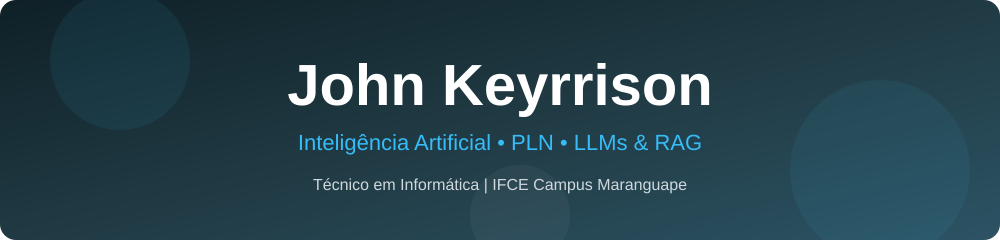
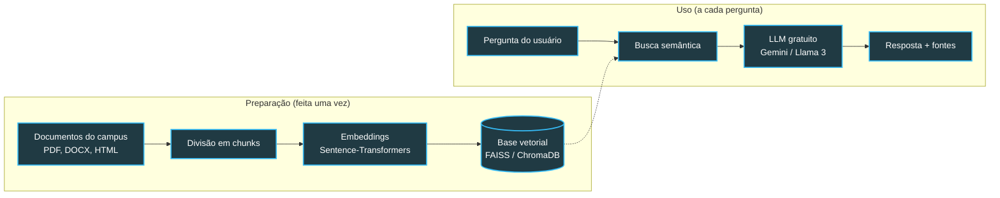

<div align="center">
  
</div>

<p align="center">
  <a href="https://git.io/typing-svg">
    
  </a>
</p>

<p align="center">
  
  
  
  
</p>

---

## 👨‍💻 Sobre mim

Sou estudante do curso **Técnico Integrado em Informática** no **Instituto Federal do Ceará (IFCE) — Campus Maranguape**. Desenvolvo pesquisas aplicadas em **Inteligência Artificial, Processamento de Linguagem Natural (PLN)** e **Desenvolvimento de Software**.

Integro o **LEIAH (Laboratório de Eletrônica, Informática Aplicada e Humanidades)**, onde busco conectar tecnologia de ponta, acessibilidade e impacto social para a comunidade acadêmica.

```text
🎓 Formação    → Técnico Integrado em Informática | IFCE Maranguape
🔬 Pesquisa    → PIBIC-AF Jr. 2026 (Chatbot acadêmico com LLMs + RAG)
🧪 Laboratório → LEIAH – Eletrônica, Informática Aplicada e Humanidades
🌱 Aprendendo  → Python avançado, LangChain/LlamaIndex, ChromaDB/FAISS, APIs de LLM
```

---

## 🔬 Projeto em destaque — PIBIC-AF Jr. 2026

<table>
  <tr>
    <td>
      <h3>🤖 Assistente Inteligente do IFCE Campus Maranguape</h3>
      <p>Chatbot acadêmico que responde dúvidas da comunidade (estudantes, servidores, familiares e visitantes) sobre <b>calendário, regimento, ementas, editais e procedimentos administrativos</b>. Usa <b>LLMs gratuitos</b> e a técnica <b>RAG (Geração Aumentada por Recuperação)</b>, sempre indicando <b>as fontes</b> de cada resposta.</p>
      <p>
        
        
        
        
        
        
      </p>
    </td>
  </tr>
</table>

**Como o chatbot funciona:**



**Etapas do projeto (set/2026 → ago/2027):**

| Fase | Período | Entrega |
|------|---------|---------|
| 📚 **Base de conhecimento** | Set → Nov/2026 | Documentos do campus coletados, segmentados e indexados em base vetorial |
| ⚙️ **Pipeline RAG** | Dez/2026 → Mar/2027 | Chatbot em Python comparando pelo menos 3 LLMs gratuitos |
| 🌐 **Interface e avaliação** | Abr → Ago/2027 | App web acessível (WCAG 2.1), teste com 100+ perguntas reais e apresentação no Encontro de Iniciação Científica do IFCE |

> 👩‍🏫 Orientação: Profa. Dra. Jessyca Almeida Bessa

---

## 🔐 Projeto em equipe — PassGuardian

<table>
  <tr>
    <td>
      <h3>🔑 PassGuardian — gerenciador de senhas em Java + JavaFX</h3>
      <p>Aplicativo em desenvolvimento <b>em equipe</b> na organização <a href="https://github.com/PassWarriors"><b>PassWarriors</b></a> para a disciplina de <b>Programação Orientada a Objetos (POO)</b>. A proposta é ser <i>"a chave para a sua segurança digital"</i>, aplicando na prática classes, encapsulamento, herança e polimorfismo em uma interface gráfica com JavaFX.</p>
      <p><b>Algumas Funcionalidades:</b></p>
      <ul>
        <li>Salvar</li>
        <li>Criptografar</li>
        <li>Checkar</li>
      </ul>
      <p>
        
        
        
        
      </p>
    </td>
  </tr>
</table>

---

## 🔭 Áreas de interesse

| | |
|---|---|
| 🧠 **Inteligência Artificial** | 💬 **Engenharia de Prompt** |
| 🗄️ **Bancos de Dados Vetoriais** | 🔌 **Eletrônica Básica** |
| 🌐 **Programação Web** | 📡 **Redes** |

---

## 🛠️ Tecnologias

<div align="center">


<br><br>


</div>

---

## 📊 Estatísticas do GitHub

<div align="center">
  
  
</div>

<div align="center">
  
</div>

---

## 🐍 Contribuições

<div align="center">
  <picture>
    <source media="(prefers-color-scheme: dark)" srcset="https://raw.githubusercontent.com/JKeyrrison/JKeyrrison/output/github-contribution-grid-snake-dark.svg" />
    
  </picture>
</div>

---

## 📫 Vamos conversar?

<div align="center">
  <a href="mailto:keyrrisonjohn186@gmail.com">
    
  </a>
  <a href="http://lattes.cnpq.br/0291449767609376">
    
  </a>
</div>

<br>

<div align="center">
  <i>"Aprender, construir, errar, corrigir e repetir."</i>
</div>

<br>


